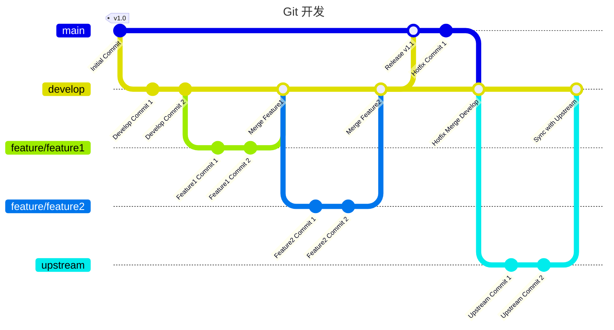

# Krita

开源数字绘画软件,跨平台应用程序,隶属于 KDE 项目.

## 项目架构

### 主程序源代码架构

```
.
├── benchmarks // 性能测试
├── _build // 构建目录
├── build-tools
│   ├── ci-scripts // 构建脚本
├── cmake
├── krita
│   ├── data
│   ├── dtd
│   ├── integration
│   ├── pics
├── libs
│   ├── basicflakes
│   ├── brush
│   ├── color
│   ├── command
│   ├── flake
│   ├── global
│   ├── image
│   ├── impex
│   ├── koplugin
│   ├── libkis
│   ├── macosutils
│   ├── Mainpage.dox
│   ├── metadata
│   ├── multiarch
│   ├── pigment
│   ├── psd
│   ├── psdutils
│   ├── resources
│   ├── resourcewidgets
│   ├── store
│   ├── ui // 用户界面
│   ├── version
│   ├── widgets
│   └── widgetutils
├── LICENSES
├── _packaging // 构建产物目录
├── packaging
│   ├── android
│   ├── linux
│   ├── macos
│   ├── steam
│   └── windows
├── pch // 预编译头文件
├── pics // 图片和 QT 工程文件
├── plugins // 插件,PYTHON, LUA, C++
├── po // 多语言支持

```

### Qt for Android

#### 原理图:


#### 最新架构:


### 涉及技术

- `Qt6 / C++` UI、逻辑
- `Python3` 插件/构建脚本
- CMake 构建
- _Docker_ CI
- Android
- KDE Frameworks
- OpenGL

## 构建

### 构建系统

- krita 依赖管理 [krita-deps-management](https://invent.kde.org/dkazakov/krita-deps-management.git)

- krita utilities [ci-utilities](https://invent.kde.org/dkazakov/ci-utilities.git)

- 签名库 [ci-notary-service](https://invent.kde.org/sysadmin/ci-notary-service.git)

- kde utilities [ci-utilities](https://invent.kde.org/sysadmin/ci-utilities.git)

### 手动打包

[Building Krita with Docker on Linux](https://docs.krita.org/en/untranslatable_pages/building/build_krita_with_docker_on_linux.html#building-krita-with-docker)

### docker 构建

- 构建打包镜像 `make image`
  
- 打包 `make`

### ci 构建(jenkins)

todo

## 二次开发

### 编码规范

`./HACKING` 文件中包含了开发规范.

### 开发流程


## 风险

- QT 商业化/开源

## 参考

[How Qt for Android Works](https://doc.qt.io/qt-6/android-how-it-works.html)

[Technical Pages](https://docs.krita.org/en/untranslatable_pages.html)

[Krita Posts](https://krita.org/en/posts/)
